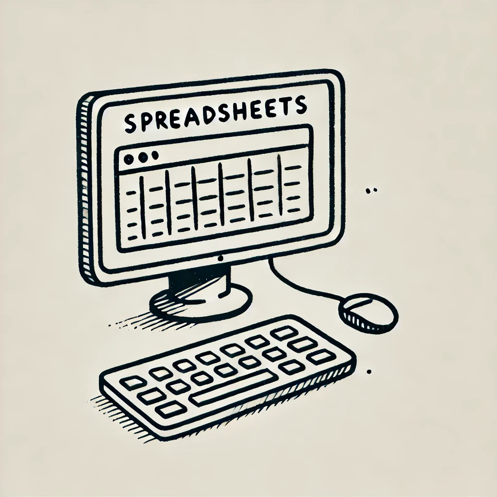

# A Beginner’s Guide to Mastering Spreadsheets
Spreadsheets are powerful tools for organizing, analyzing, and visualizing data. Whether you are using **Google Sheets**, **Microsoft Excel**, or other spreadsheet applications, learning key functionalities can improve your efficiency. This guide compiles essential resources for beginners and advanced users to master spreadsheet skills.

## 📌 Getting Started with Spreadsheets
Before diving into complex formulas, it's crucial to understand the basics:
- [Google Sheets Help Center](https://support.google.com/docs/answer/181110)
- [Google Workspace Learning Center - Spreadsheets](https://support.google.com/a/users/answer/9300311?hl=en&ref_topic=9296423)
- [Microsoft Excel Basics](https://support.microsoft.com/en-us/office/keyboard-shortcuts-in-excel-1798d9d5-842a-42b8-9c99-9b7213f0040f?ui=en-US&rs=en-US&ad=US)

## 🎓 Mastering Spreadsheet Shortcuts
Learning keyboard shortcuts can significantly boost productivity:
- [Google Sheets Keyboard Shortcuts](https://support.google.com/docs/answer/46973?co=GENIE.Platform%3DDesktop&hl=en&oco=0)
- [Windows Keyboard Shortcuts](https://support.microsoft.com/en-us/windows/keyboard-shortcuts-in-windows-dcc61a57-8ff0-cffe-9796-cb9706c75eec)
- [Mac Keyboard Shortcuts](https://support.apple.com/en-us/HT201236)

## 🔍 Essential Spreadsheet Functions
Understanding basic functions is key to manipulating data efficiently:
- [COUNTIF Function](https://support.microsoft.com/en-us/office/countif-function-e0de10c6-f885-4e71-abb4-1f464816df34)
- [VLOOKUP Function](https://support.microsoft.com/en-us/office/vlookup-function-0bbc8083-26fe-4963-8ab8-93a18ad188a1)
- [DATEDIF Function](https://support.microsoft.com/en-us/office/datedif-function-25dba1a4-2812-480b-84dd-8b32a451b35c)

## 📊 Data Formatting & Cleaning
Learn how to format and clean data to make it more readable and useful:
- [Converting Text to Date](https://www.ablebits.com/office-addins-blog/excel-convert-text-date/)
- [Changing Date Formats in Google Sheets](https://www.ablebits.com/office-addins-blog/google-sheets-change-date-format/)
- [Convert Text to Numbers](https://productivityspot.com/convert-text-to-numbers-google-sheets/)

## 📑 Sorting & Filtering Data
Efficiently sorting and filtering data helps in analyzing large datasets:
- [Sorting Data in Excel](https://support.microsoft.com/en-us/office/video-sort-data-in-a-range-or-table-ffb9fcb0-b9cb-48bf-a15c-8bec9fd3a472#ID0EAABAAA=Transcript)
- [Sorting in Google Sheets](https://support.google.com/docs/answer/3093150?hl=en)
- [Filtering Data in Excel](https://support.microsoft.com/en-us/office/filter-data-in-a-pivottable-cc1ed287-3a97-4e95-b377-ddfafe79fa8f)

## 🖥 Pivot Tables & Data Analysis
Pivot Tables are essential for summarizing and analyzing large datasets:
- [Creating Pivot Tables in Google Sheets](https://www.benlcollins.com/spreadsheets/pivot-tables-google-sheets/)
- [Pivot Table Calculated Field Example](https://exceljet.net/pivot-tables/pivot-table-calculated-field-example)
- [Sorting Data in Pivot Tables](https://support.microsoft.com/en-us/office/sort-data-in-a-pivottable-or-pivotchart-e41f7107-b92d-44ef-861f-24430830450a)

## ✅ Conclusion
Spreadsheets are powerful tools that help in data organization, analysis, and reporting. By exploring these resources, both beginners and advanced users can develop a strong foundation in spreadsheet skills.

📌 *Happy Spreadsheeting!*
